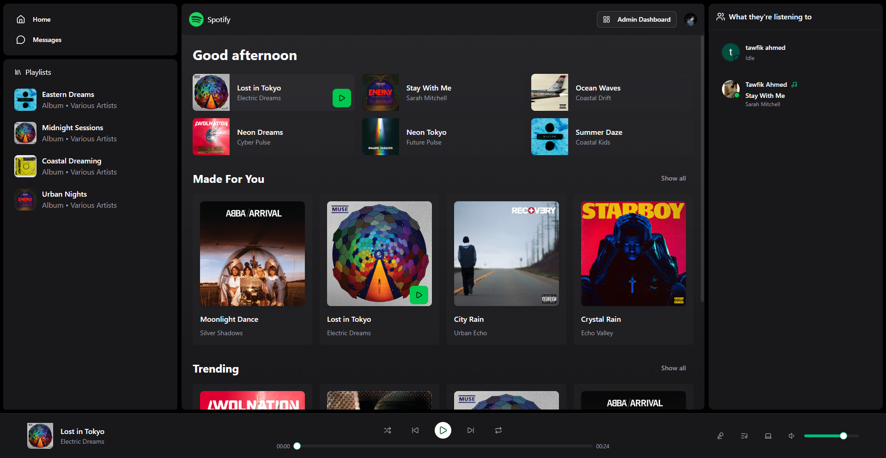
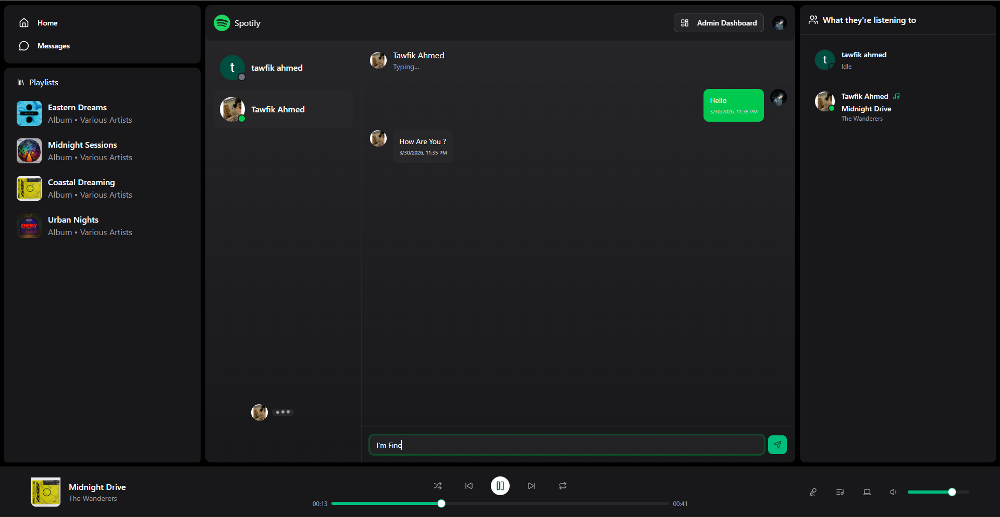
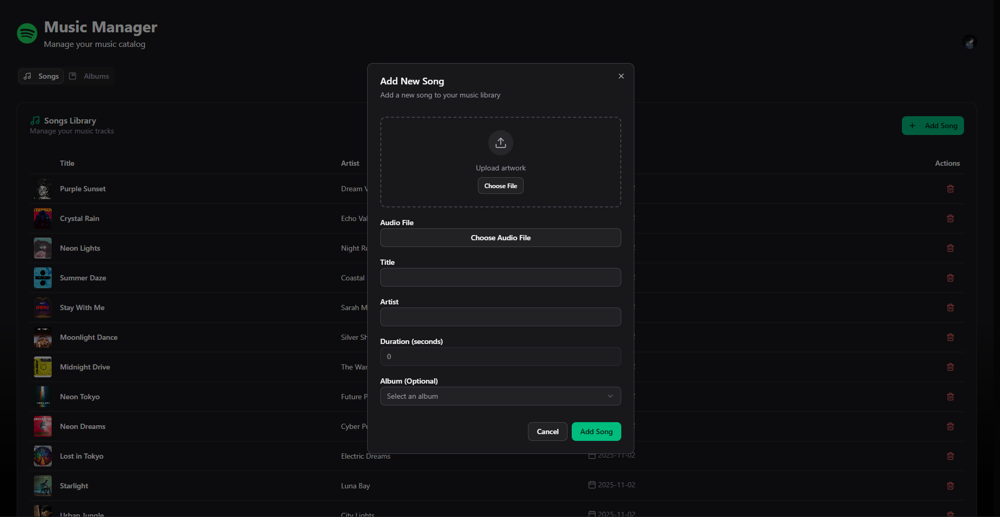

# Spotify Clone (Front-End)

  

  
  

  
Back-End Repo: [https://github.com/tawfik-ahmed/Spotify_Clone_Backend]

Spotify Clone is a modern music streaming web application that replicates the core experience of Spotify. It delivers a smooth, responsive, and real-time interactive UI, allowing users to enjoy music playback, chat with others, and see live activity across the platform.

## Technologies Used (In Practice)

- React: Used to build a modular and scalable component-based UI, including the player, sidebar, chat system, and admin dashboard
- Axios: Handles all communication with the backend such as fetching songs, playlists, user data, and sending admin actions
- Zustand: Manages global state like current song, playback status, user session, and real-time shared states across components
- Socket.IO: Powers real-time features including chat, typing indicators, active users status, and live "currently listening" updates
- TailwindCSS: Used to design a fully responsive and clean UI, including layouts for the player, chat, and dashboards
- TypeScript: Enforces type safety across the app, especially for API responses, socket events, and global state
- Clerk: Handles authentication, protected routes, and user session management

## Key Features

- Full Spotify-like user interface and experience
- Secure user authentication using Clerk
- Music player with play, pause, and track control functionality
- Dynamic playlists and song browsing
- Real-time chat system between users
- Online/active users indicator
- Typing indicator for real-time conversations
- Ability to see what other users are currently listening to
- Live updates using Socket.IO
- Smooth state management using Zustand
- Seamless API integration with Axios
- Clean and responsive UI built with TailwindCSS
- Fully responsive across devices
- Admin dashboard to add songs and manage playlists
- Built entirely with TypeScript for scalability and maintainability

Spotify Clone (Front-End) focuses on delivering a fast, interactive, and socially engaging music streaming experience, combining real-time communication with rich media playback and admin-level content management.
